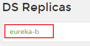
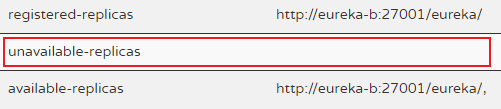
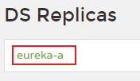
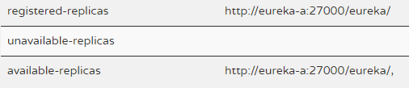

## 集群

### 注意点

1. `spring.application.name` 要一致。
2. `eureka.client.register-with-eureka` 和 `eureka.client.fetch-registry` 都要设置为 **true**  或者不加上该配置。
3. `eureka.instance.hostname` 要不相同。（单机模拟时可以修改host达到集群效果）
4. `eureka.client.service-url.defaultZone` 不能使用localhost，要使用域名。
5. `eureka.instance.prefer-ip-address` 设置为 **false** 或者不加上该配置。

### 配置示例

eureka-a 的 application.yml 配置文件（详细版）

```yaml
server:
  port: 27000

spring:
  application:
    name: eureka-server

eureka:
  instance:
    # 应用实例主机名
    hostname: eureka-a
  client:
    # 是否向注册中心注册该实例，默认true。Eureka单机可以改为false，集群要true。
    register-with-eureka: true
    # 是否从Eureka获取注册信息，默认true。Eureka单机可以改为false，集群要true。
    fetch-registry: true
    service-url:
      # 单机，http://${eureka.instance.hostname}:${server.port}/eureka
      # 集群，填写其他注册中心的地址，以逗号分隔。
      defaultZone: http://eureka-b:27001/eureka
```

eureka-b 的 application.yml 配置文件（精简版）

```yaml
server:
  port: 27001

spring:
  application:
    name: eureka-server

eureka:
  instance:
    hostname: eureka-b
  client:
    service-url:
      defaultZone: http://eureka-a:27000/eureka
```

### 集群成功效果

访问eureka-a的网页（http://eureka-a:27000/）





访问eureka-b的网页（http://eureka-b:27001/）





当eureka网页显示以上效果时，说明Eureka集群成功了。特别是 `unavailable-replicas` ，如果不为空时，说明有某个eureka服务节点不可用，即集群失败。


